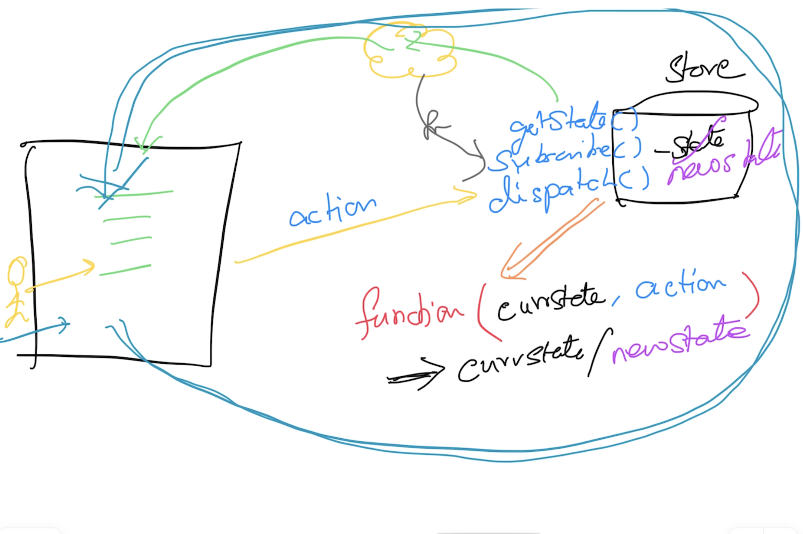

## State Manager

```
function spinnerReducer(currentState = 50, action){
    if (action.type === 'INCREMENT') return currentState + 1;
    if (action.type === 'DECREMENT') return currentState - 1;
    return currentState;
}

const store = StateManager.createStore(spinnerReducer)

store.getState()

store.dispatch({type : 'INCREMENT'})
store.getState()

store.dispatch({type : 'INCREMENT'})
store.getState()

store.subscribe(() => console.log('spinner value :', store.getState()))

store.dispatch({type : 'INCREMENT'})

store.dispatch({type : 'INCREMENT'})

store.dispatch({type : 'INCREMENT'})

store.dispatch({type : 'DECREMENT'})

store.dispatch({type : 'DECREMENT'})

store.dispatch({type : 'DECREMENT'})

store.dispatch({type : 'DOANYTHING'})
```

## Function composition
```
let fns = {
    f1(){
        console.log('f1 invoked');
    },
    f2(){
        console.log('f2 invoked');
    }
}

let loggedFns = {};
for(let attrName in fns) {
    loggedFns[attrName] = function(){
        console.log('begin invocation');
        fns[attrName]();
        console.log('end invocation');
    }
}

loggedFns.f1()
loggedFns.f2()
```

## ES6 Modules
- Everything defined in a file (js/jsx) is by default considered as 'PRIVATE'
- The public entities have to be explicitly 'EXPORTED'
- Public entities from other files have to be explicitly 'IMPORTED' to be used

## Recordings
- https://bit.ly/react-videos

373 864 023 359
mrkL6c